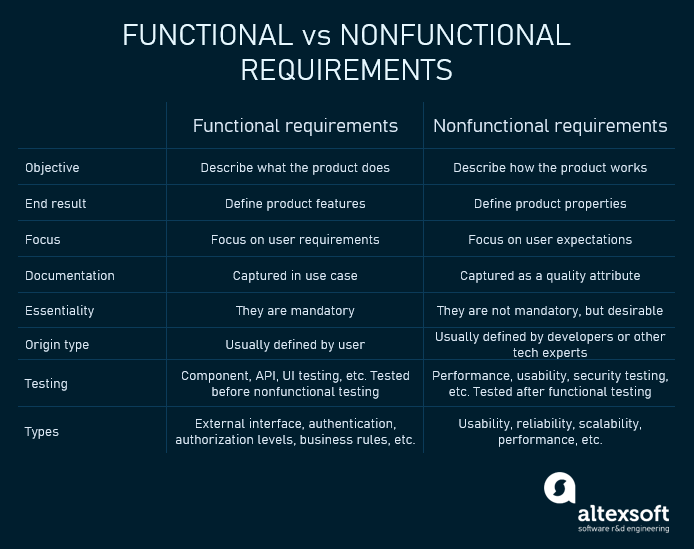
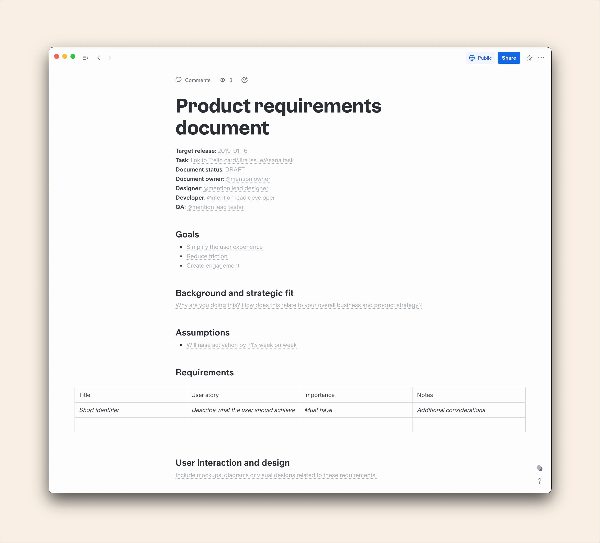

# **Phân tích yêu cầu**

(Requirement analysis)

---

## **Nội dung**

1. Định nghĩa yêu cầu
1. Tài liệu định nghĩa yêu cầu

---

## **Định nghĩa yêu cầu**

Một yêu cầu (requirement) là một diễn tả chức năng hoặc đặc điểm mà hệ thống phải có.

Có 2 loại yêu cầu cơ bản:

- **Yêu cầu chức năng (functional requirement)**
- **Yêu cầu phi chức năng (nofunctional requirement)**

---

### **Yêu cầu về chức năng**

**Yêu cầu chức năng (functional requirement):** là các tính năng hoặc chức năng phải có, liên quan trực tiếp đến hoạt động của hệ thống.

Ví dụ:

- Hệ thống xác thực thông tin đăng nhập khi người dùng gửi yêu cầu đăng nhập lên server.
- Hệ thống gửi email xác nhận khi người dùng mới tạo được tài khoản.

---

### **Yêu cầu phi chức năng**

**Yêu cầu phi chức năng (nofunctional requirement):** là các yêu cầu về tính chất, đặc điểm mà hệ thống phải có như: khả năng hoạt động, khả năng sử dụng, hiệu suất,...

Ví dụ:

- Các trang web phải tải xong trong 3s với số lượng người dùng đồng thời < 5000

---

_Nguồn [altexsoft.com](https://www.altexsoft.com/blog/business/functional-and-non-functional-requirements-specification-and-types/)_

---

## **Tài liệu định nghĩa yêu cầu**

**Tài liệu định nghĩa yêu cầu** là văn bản liệt kê các yêu cầu chức năng và phi chức năng của hệ thống. Tài liệu định nghĩa yêu cầu dùng để truyền đạt các mục tiêu của dự án một cách rõ ràng, ngắn gọn để đảm bảo các bên liên quan đều thống nhất.

