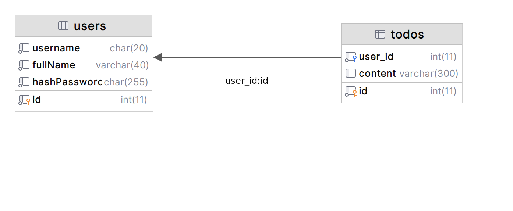

# **Ràng buộc trong cơ sở dữ liệu**

(Constraint)

---

## **Nội dung**

1. Định nghĩa ràng buộc
1. Các loại ràng bụộc
1. Ví dụ về ràng buộc trong cơ sở dữ liệu

---

## **Ràng buộc là gì?**


Ràng buộc (Constraint) là những quy tắc được áp dụng trên các cột dữ liệu, trên bảng. Được sử dụng để kiểm tra tính hợp lệ của dữ liệu vào, đảm bảo tính chính xác, tính toàn vẹn của dữ liệu.

---

## **Các loại ràng buộc phổ biến**

| Tên ràng buộc | Ý nghĩa                                                    |
| ------------- | ---------------------------------------------------------- |
| NOT NULL      | Đảm bảo cột không nhận giá trị null(phải có giá trị)       |
| DEFAULT       | Gán giá trị mặc định cho cột trong                         |
| UNIQUE        | Đảm bảo dữ liệu ủa cột là duy nhất                         |
| PRIMARY KEY   | Thiết lập khóa chính trên bảng                             |
| FOREIGN KEY   | Thiết lập khóa ngoại của bảng, tham chiếu đến bảng khác    |
| CHECK         | Đảm bảo giá trị của cột phải thỏa mãn một điều kiện nào đó |

---

## **Ví dụ về ràng buộc trong cơ sở dữ liệu**

Xây dựng cơ sở dữ liệu cho một ứng dụng Todo app đơn giản gồm có 2 bảng

- Bảng `users`(id, username, fullName, hashPassword)

  - `id` có kiểu int và là khóa chính
  - `username` có kiểu chuỗi, có giá trị duy nhất và có độ dài từ 3 ~ 20 ký tự
  - `fullName` có kiểu chuỗi và có độ dài tối đa là 300 ký tự
  - `hashPassword` có kiểu chuỗi và không được `null`

- Bảng `todos`(id, user_id, content)
  - `id` có kiểu int và là khóa chính
  - `user_id` có kiểu int và tham chiếu đến thuộc tính `id` của bảng `users`
  - `content` có kiểu chuỗi và độ dài tối đa là 300 ký tự

---

## **Ví dụ về ràng buộc trong cơ sở dữ liệu**

Tạo bảng `users` (Câu truy vấn thực hiện trên mariadb:10)

```sql
create table users
(
    id       int  not null primary key auto_increment,
    username char(20) not null unique,
    fullName varchar(40) not null,
    hashPassword char(255) not null,
    check (length(username) >= 3 and length(username) <= 20)
);
```

---

## **Ví dụ về ràng buộc trong cơ sở dữ liệu**

Tạo bảng `todos` (Câu truy vấn thực hiện trên mariadb:10)

```sql
create table todos(
    id int not null primary key auto_increment,
    user_id int not null,
    content varchar(300) default 'Replace your job!',
    foreign key (user_id) references users(id)
);
```

---

## **Ví dụ về ràng buộc trong cơ sở dữ liệu**


